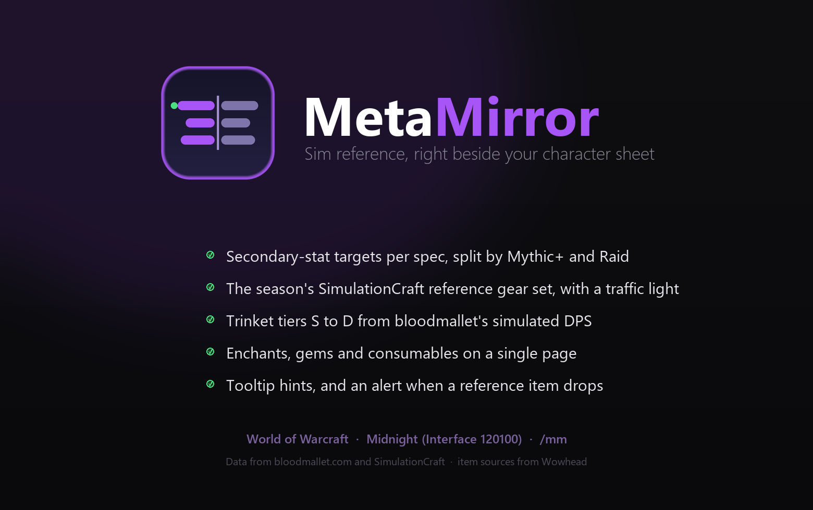

**Top-player meta, mirrored to your character.** A World of Warcraft addon for
*Midnight* (Interface 120100).

MetaMirror shows what the best players of *your* spec are running and holds it up
against your own character, live. No browser tabs, no spreadsheets: open your
character sheet and the meta is right there next to it. Your spec is auto-detected,
there is nothing to configure.



---

## What it does

| Tab | What you get |
| --- | --- |
| **Stats** | Every secondary stat against the top-player target: fill bar, target marker, your live rating. Swap a piece of gear and the bars move instantly. |
| **Gear** | The meta piece per slot with **where it drops**, read from the in-game Adventure Guide, plus how many top players use it and what you already own. |
| **Trinkets** | Sim tiers from bloodmallet.com, re-ordered by real top-player usage. Mythic+ and Raid are ranked separately. |
| **Upgrades** | The exact enchants, gems and consumables the top players run. |

On top of that, a **BiS-drop alert**: when a top-tier item drops for someone in your
group, MetaMirror flags it and offers a one-click polite whisper to ask for it.

Type `/mm` to toggle the window, or just open your character sheet.

## Install

Grab it from CurseForge, or copy the addon files into
`World of Warcraft/_retail_/Interface/AddOns/MetaMirror/`. Only the files listed in
`MetaMirror.toc` plus `Icon.tga` and `bar-mask.tga` belong there; everything else in
this repository is build tooling.

---

## How the data is made

The addon ships with pre-built data files. Nothing is fetched at runtime, so the
addon never talks to the network while you play.

```
bloodmallet.com  ─┬─►  pipeline/  ─►  Data/MetaMirrorTrinkets.lua
Wowhead          ─┘                   Data/MetaMirrorSources.lua
```

- **bloodmallet.com** supplies simulated trinket DPS per spec and content type.
- **Wowhead** fills in item sources the Adventure Guide does not carry, such as
  crafted, vendor, delve and PvP trinkets.

### About Warcraft Logs

Earlier versions of this addon shipped an aggregate built from the Warcraft Logs
API — what top parses actually wear and use. **That data has been removed.**

On 2026-09-04 RPGLogs confirmed in writing that their Terms of Service do not
permit views of data from their sites to be redistributed through other channels,
and that addons are specifically named as a channel they do not allow. The weekly
refresh has been switched off, the generated file is gone from this repository and
its history, and the addon no longer loads or displays it. Please do not send pull
requests that reintroduce it.

## Development

```bash
python -m pytest pipeline/ -q
```

In-game diagnostics live behind `/mm`: `status` for panel state, `scansrc` to rebuild
and inspect the item-source index, `dumpsrc`, `dumpench`, `dumpgems` for raw dumps.

---

Data from [bloodmallet.com](https://bloodmallet.com/). Item sources from
[Wowhead](https://www.wowhead.com/). Not affiliated with Blizzard Entertainment.
